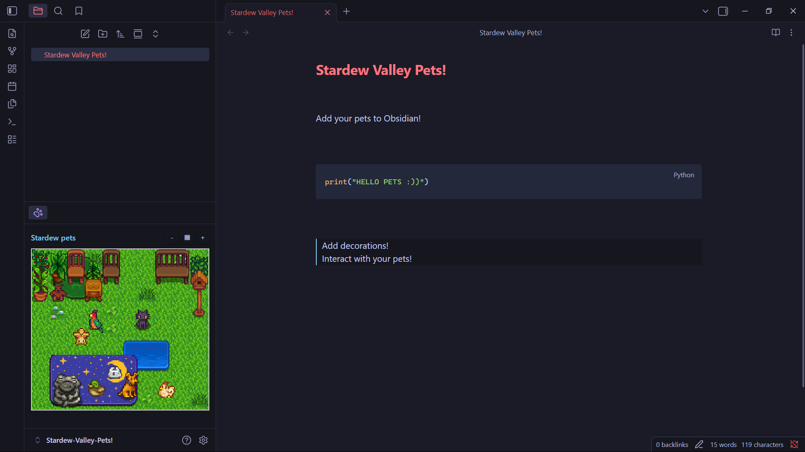
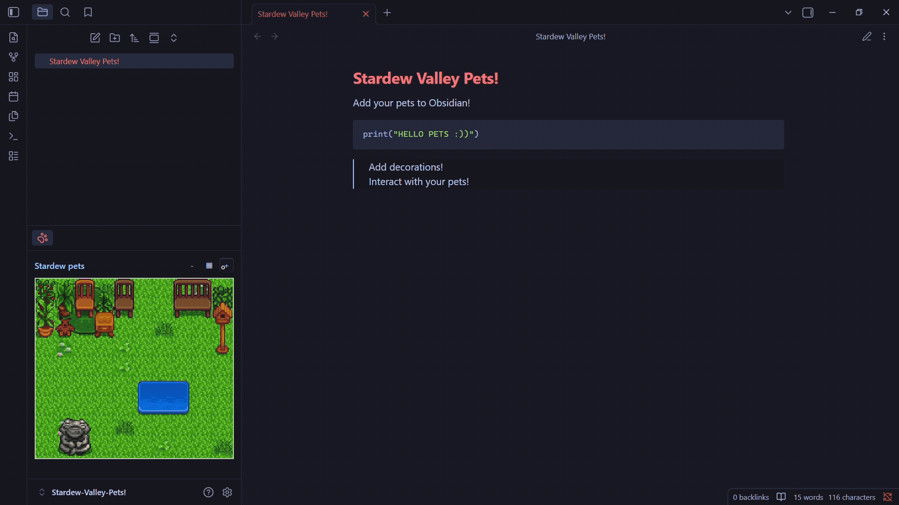

# Stardew Pets Farm


Bring a tiny animated farm to your vault. Stardew Pets Farm adds a playful view where pixel pets wander around, react to clicks, and live alongside placeable pixel decorations while you work.

Inspired by [BOTPanzer](https://github.com/BOTPanzer/Stardew-Pets). Thank you so much!!!

## Open the view




1. Open the Command Palette (`Ctrl+P`).
2. Run `Stardew Pets Farm: Open stardew farm`.
3. Enjoy!



## Features

- A dedicated Stardew Pets Farm view in your sidebar.
- Add named pets from the `+` menu.
- Remove pets with `-` mode.
- Persistent pets and decorations using Obsidian plugin data.
- Natural movement patterns with pauses and occasional sleep.
- Click a pet to stop it briefly, play a reaction, and show a pixel-heart bubble.
- Add decorations from the decoration menu.
- Place decorations on a 16px grid for pixel-style alignment.
- Remove decorations with `-` mode.
- Rugs and carpets stay below pets, so pets can walk over them.
- Sprites are bundled into `main.js`, so installs from the Obsidian store do not need a separate `sprites/` folder.

## Development

- Clone the git repo in your plugins folder.
- Install: `npm install`
- Dev build: `npm run dev`
- Production build: `npm run build`


```
<Vault>/.obsidian/plugins/stardew-pet-farm/
```
